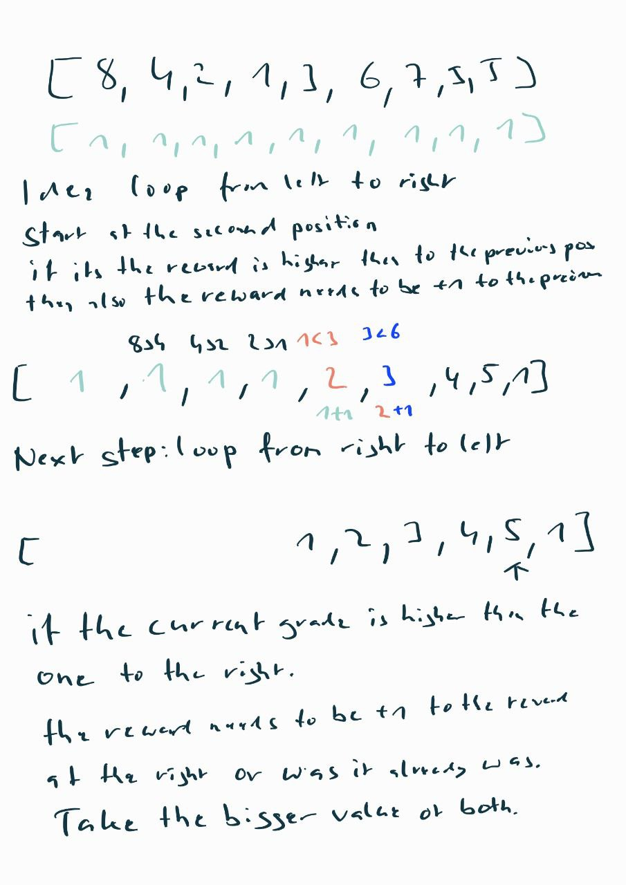

# minReward  
## Description This repository contains the solution for the minReward problem. 
### Problem Statement The minReward problem is a classic problem in computer science that involves to give rewards to a class. The grade of the students are given as an array. 
* Each student should get at least 1 reward an
 * Any student must receive stricty more rewards than an adjacent student with lower score and less rewards then an adjacent student with a higher score  
 ### Example.

  

