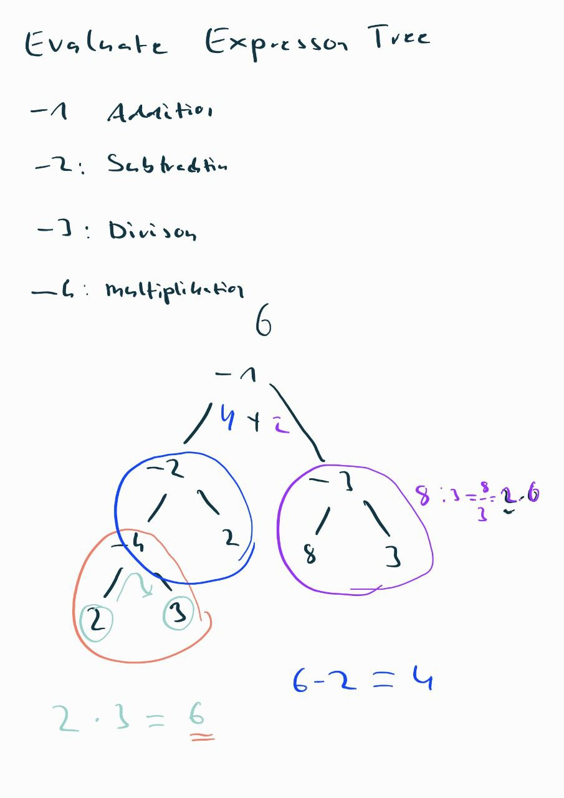

# Evaluate binary expression trees
This  project  evaluates binary expression trees.   
The leaves of the trees represent values (greater than or equal to 0) and the non-leaf nodes represent operations   
 * addition `-1`  
 * subtraction `-2`  
 * division `-3`  
 * multiplication `-4`  

  

