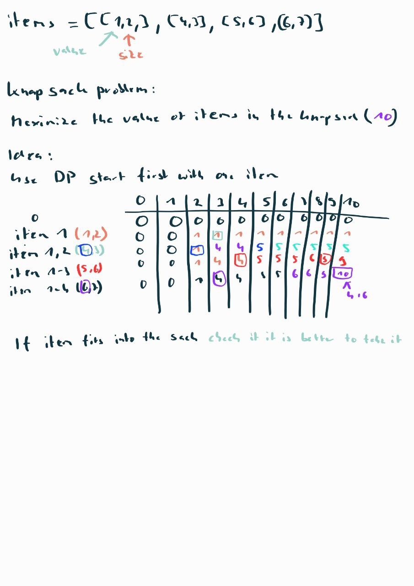

#  Knapsack Problem
Use Dynamic Programming to solve the Knapsack problem from
combinatorial optimization. It derives its name from the real-world problem facing someone who is constrained by a fixed-size knapsack and must fill it with the most valuable items.
Given a List of item the first index is the value (int) and second (int) is the weight,
and an integer that shows the weight.  

 

  

