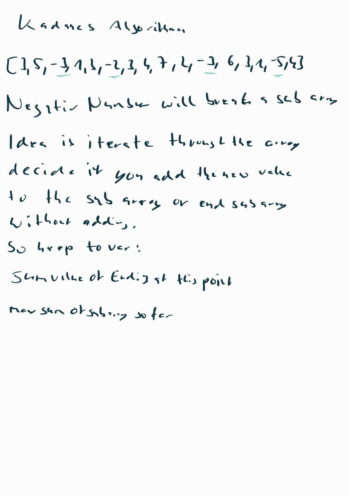

# Kadane's Algorithm

Kadane's algorithm is a well-known and efficient solution to the problem of finding the maximum sum of a contiguous subarray within a one-dimensional array of numbers.

Problem Statement

The problem requires you to find the subarray in an integer array that has the maximum sum. A subarray is a contiguous part of an array, which means that the elements in the subarray must be consecutive elements from the original array.

Here's an example: In the array [−2, 1, −3, 4, −1, 2, 1, −5, 4], the contiguous subarray with the largest sum is [4, −1, 2, 1], with sum 6.

  

