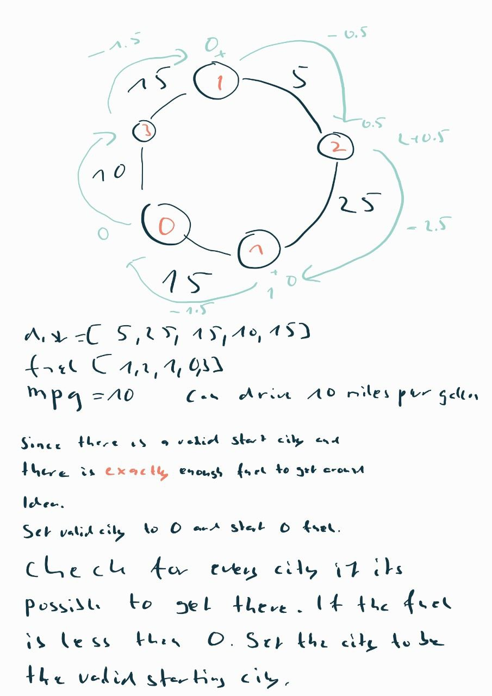

 # Valid Starting City Problem

## Problem Statement

You are given a list of `n` cities connected in a circular manner. For each city, you know the distance to the next city and the amount of fuel available. You also know how much fuel is needed to travel one mile. Your task is to find a starting city from which you can travel around the circuit exactly once, ending up back at the starting city, without running out of fuel.

Given:

-   A list of distances between each pair of adjacent cities.
-   A list of the amount of fuel available at each city.
-   The amount of fuel needed to travel one mile.

Assumptions:

-   There is always a valid starting city.
-   There is exactly enough fuel to complete the circuit.

## Example

Let's consider an example where we have 4 cities with the following data:

Distances: [5, 25, 15, 10, 15] Fuel: [1, 2, 1,0, 3] Mileage: 10 mile/gallon

In this case, the valid starting city is City 4.

## Solution Idea

We can solve this problem using a greedy strategy.

1.  **Initialization**: Start at any city with an empty fuel tank.
2.  **Travel**: For each city from 0 to `n-1`, refill your tank with the fuel available at the current city, and then travel to the next city, reducing your fuel by the distance to the next city.
3.  **Check**: If at any point your fuel becomes negative, that means you couldn't reach the next city from the current starting city. In this case, you'll have to start over from the next city with an empty fuel tank.
4.  **Complete the circuit**: If you successfully reach back to the city you started from without your fuel becoming negative, then the city you started from is a valid starting city.

In terms of time complexity, this algorithm takes linear time (O(n)) because you only need to visit each city once, where `n` is the number of cities.

  

